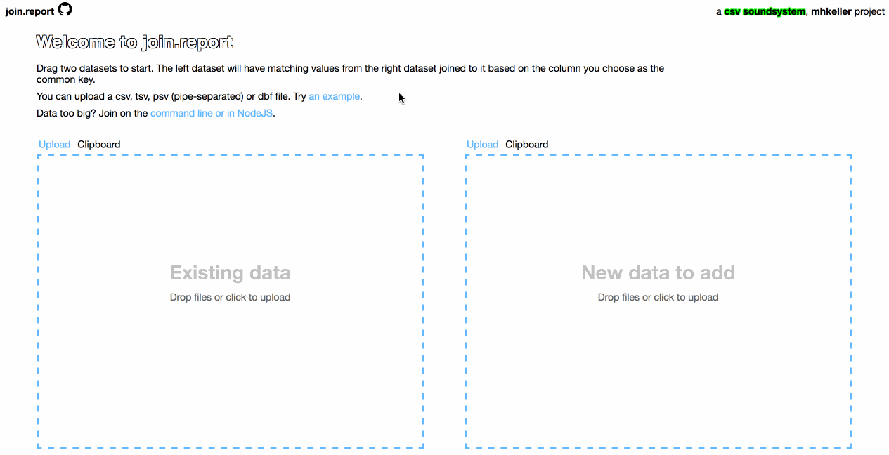

join.report
===========

> Join data and get a report back of how well it went: http://join.report

## About

A browser-utility for performing sql-like joins on datasets. It supports reading and writing of  csv, tsv, psv, *json and dbf data files.

**Note**: No data leaves your computer. All work is done locally in your browser.

A [csv soundsystem](csv.nyc) project.

## FAQ

### What makes it different?

You can do joins in any number of languages and environments. I wanted something gave me an explanation of which rows found a match and which didn't and I could use it in a quick, drag-and-drop environment.

The command-line and NodeJS utility, [joiner](https://github.com/mhkeller/joiner), does the joining and diff reporting. This site provides the nice web interface.

### Is my data sent to a server?

No. All your data remains locally on your computer. The processing is handled 100 percent on your machine.

### Can I edit the data once I add it?

Yes! You can click into a cell to edit the value directly or click the X to the right to exclude an entire row. If you exclude a row by mistake, click on the arrow that appears in its place to undo.

### My data is too big for the browser. What do I do?

You can try the command-line version of the library this uses: [Joiner](https://github.com/mhkeller/joiner).

## Other joining resources

Here is a collection of other tools that let you do joins:

* [QGIS](https://qgis.org)
* [mapshaper](https://github.com/mbloch/mapshaper)

## Inspiration

This site and the joiner utility was inspired by Noah Veltman's [mapstarter.com](https://mapstarter.com).

## Icon attribution

Trash Can by Ben Iconator from the Noun Project
Download by Numero Uno from the Noun Project
Sort Ascending by Travis Avery from the Noun Project
Sort Descending by Travis Avery from the Noun Project
